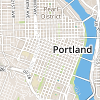
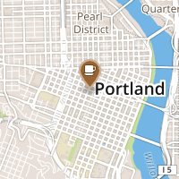
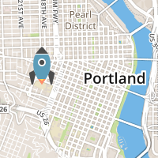
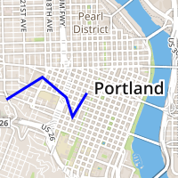
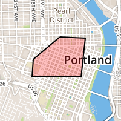
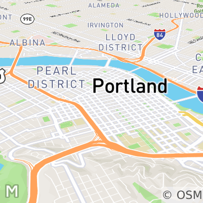
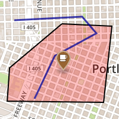

# MapboxStatic

[📱&nbsp;](https://www.bitrise.io/app/faa9d29af3e2ce7a) &nbsp;&nbsp;&nbsp;
[🖥💻&nbsp;](https://www.bitrise.io/app/5f8ae2a3885d8173) &nbsp;&nbsp;&nbsp;
[📺&nbsp;](https://www.bitrise.io/app/76cb1d11414a5b80) &nbsp;&nbsp;&nbsp;
[⌚️&nbsp;](https://www.bitrise.io/app/cd7bcec99edcea34) &nbsp;&nbsp;&nbsp;
[](https://github.com/Carthage/Carthage) &nbsp;&nbsp;&nbsp;
[](http://cocoadocs.org/docsets/MapboxStatic.swift/)

MapboxStatic.swift makes it easy to connect your iOS, macOS, tvOS, or watchOS application to the [Mapbox Static API](https://www.mapbox.com/api-documentation/#static) or the [classic Mapbox Static API](https://www.mapbox.com/api-documentation/#static-classic). Quickly generate a map snapshot – a static map image with overlays – by fetching it synchronously or asynchronously over the Web using first-class Swift or Objective-C data types.

A snapshot is a flattened PNG or JPEG image, ideal for use in a table or image view, user notification, sharing service, printed document, or anyplace else you’d like a quick, custom map without the overhead of an interactive view. A static map is created in a single HTTP request. Overlays are added server-side.

MapboxStatic.swift pairs well with [MapboxDirections.swift](https://github.com/mapbox/MapboxDirections.swift), [MapboxGeocoder.swift](https://github.com/mapbox/MapboxGeocoder.swift), the [Mapbox Maps SDK for iOS](https://www.mapbox.com/ios-sdk/), and the [Mapbox Maps SDK for macOS SDK](https://mapbox.github.io/mapbox-gl-native/macos/). If you’re already using the maps SDK for iOS or macOS for other purposes, consider using an [`MGLMapSnapshotter`](https://www.mapbox.com/ios-sdk/api/3.7.0-alpha.1/Classes/MGLMapSnapshotter.html) object instead of MapboxStatic.swift to produce static images that take advantage of caching and offline packs.

## Installation 

Specify the following dependency in your [Carthage](https://github.com/Carthage/Carthage/) Cartfile:

```sh
github "mapbox/MapboxStatic.swift" ~> 0.10
```

Or in your [CocoaPods](http://cocoapods.org/) Podfile:

```podspec
pod 'MapboxStatic.swift', '~> 0.10'
```

Then `import MapboxStatic` or `@import MapboxStatic;`. 

v0.6.2 is the last release of MapboxStatic.swift written in Swift 2.3. The `swift2.3` branch corresponds to this release, plus any critical bug fixes that have been applied since. All subsequent releases will be based on the `master` branch, which is written in Swift 3. The Swift examples below are written in Swift 3; see the `swift2.3` branch’s readme for Swift 2.3 examples.

This repository includes an example iOS application written in Swift, as well as Swift playgrounds for iOS and macOS. To run them, you need to use [Carthage](https://github.com/Carthage/Carthage) 0.19 or above to install the dependencies. Open the playgrounds inside of MapboxStatic.xcworkspace. More examples are available in the [Mapbox API Documentation](https://www.mapbox.com/api-documentation/?language=Swift#static-classic).

## Usage

You can generate a snapshot from either a Mapbox-hosted [style](https://www.mapbox.com/help/define-style/) or a raw [tile set](https://www.mapbox.com/help/define-tileset/). Using a style gives you more visual options like rotation, while using a tile set gives you a choice of image formats. If you’re working with vector data, you’ll want to use a style; if you’re working with a single raster imagery source, you may want to use a tile set.

To generate a snapshot from a style, you’ll need its [style URL](https://www.mapbox.com/help/define-style-url/). You can either choose a [Mapbox-designed style](https://www.mapbox.com/api-documentation/#styles) or design one yourself in [Mapbox Studio](https://www.mapbox.com/studio/styles/). You can use the same style within the Mapbox Maps SDK for iOS or macOS.

To generate a snapshot from a tile set, you’ll need a [map ID](https://www.mapbox.com/help/define-map-id/). You can either choose a [Mapbox-maintained tile set](https://www.mapbox.com/api-documentation/#maps) or upload your own to [Mapbox Studio](https://www.mapbox.com/studio/tilesets/).

You’ll also need an [access token](https://www.mapbox.com/help/define-access-token/) with the `styles:tiles` scope enabled in order to use this library. You can specify your access token inline or by setting the `MGLMapboxAccessToken` key in your application’s Info.plist file.

The examples below are each provided in Swift (denoted with `main.swift`) and Objective-C (`main.m`). For further details, see the [MapboxStatic.swift API reference](http://cocoadocs.org/docsets/MapboxStatic.swift/).

### Basics

The main static map class is `Snapshot` in Swift or `MBSnapshot` in Objective-C. To create a basic snapshot, create a `SnapshotOptions` object, specifying snapshot camera (viewpoint) and point size:

```swift
// main.swift
import MapboxStatic

let camera = SnapshotCamera(
    lookingAtCenter: CLLocationCoordinate2D(latitude: 45.52, longitude: -122.681944),
    zoomLevel: 12)
let options = SnapshotOptions(
    styleURL: URL(string: "<#your mapbox: style URL#>")!,
    camera: camera,
    size: CGSize(width: 200, height: 200))
let snapshot = Snapshot(
    options: options,
    accessToken: "<#your access token#>")
```

```objc
// main.m
@import MapboxStatic;

NSURL *styleURL = [NSURL URLWithString:@"<#your mapbox: style URL#>"];
MBSnapshotCamera *camera = [MBSnapshotCamera cameraLookingAtCenterCoordinate:CLLocationCoordinate2DMake(45.52, -122.681944)
                                                                   zoomLevel:12];
MBSnapshotOptions *options = [[MBSnapshotOptions alloc] initWithStyleURL:styleURL
                                                                  camera:camera
                                                                    size:CGSizeMake(200, 200)];
MBSnapshot *snapshot = [[MBSnapshot alloc] initWithOptions:options
                                               accessToken:@"<#your access token#>"];
```

Then, you can either retrieve an image synchronously (blocking the calling thread):

```swift
// main.swift
imageView.image = snapshot.image
```

```objc
// main.m
imageView.image = snapshot.image;
```



Or you can pass a completion handler to update the UI thread after the image is retrieved:

```swift
// main.swift
snapshot.image { (image, error) in
    imageView.image = image
}
```

```objc
// main.m
[snapshot imageWithCompletionHandler:^(UIImage * _Nullable image, NSError * _Nullable error) {
    imageView.image = image;
}];
```

If you're using your own HTTP library or routines, you can also retrieve a snapshot’s `URL` property.

```swift
// main.swift
let imageURL = snapshot.url
```

```objc
// main.m
NSURL *imageURL = snapshot.url;
```

To create a basic classic snapshot, create a `ClassicSnapshotOptions` or `MBClassicSnapshotOptions` object, specifying the center coordinates, [zoom level](https://www.mapbox.com/help/how-web-maps-work/#tiles-and-zoom-levels), and size in points:

```swift
// main.swift
let options = ClassicSnapshotOptions(
    mapIdentifiers: ["<#your map ID#>"],
    centerCoordinate: CLLocationCoordinate2D(latitude: 45.52, longitude: -122.681944),
    zoomLevel: 13,
    size: CGSize(width: 300, height: 200))
let snapshot = Snapshot(
    options: options,
    accessToken: "<#your access token#>")
imageView.image = snapshot.image
```

```objc
// main.m
MBSnapshotOptions *options = [[MBClassicSnapshotOptions alloc] initWithMapIdentifiers:@[@"<#your map ID#>"]
                                                                     centerCoordinate:CLLocationCoordinate2DMake(45.52, -122.681944)
                                                                            zoomLevel:13
                                                                                 size:CGSizeMake(200, 200)];
MBSnapshot *snapshot = [[MBSnapshot alloc] initWithOptions:options accessToken:@"<#your access token#>"];
imageView.image = snapshot.image;
```

### Overlays

Overlays are where things get interesting! You can add [Maki markers](https://www.mapbox.com/maki-icons/), custom marker imagery, GeoJSON geometries, and even paths made of bare coordinates.

You add overlays to the `overlays` field in the `SnapshotOptions` or `MBSnapshotOptions` object. Here are some versions of our snapshot with various overlays added.

#### Marker

```swift
// main.swift
let markerOverlay = Marker(
    coordinate: CLLocationCoordinate2D(latitude: 45.52, longitude: -122.681944),
    size: .medium,
    iconName: "cafe"
)
markerOverlay.color = .brown
```

```objc
// main.m
MBMarker *markerOverlay = [[MBMarker alloc] initWithCoordinate:CLLocationCoordinate2DMake(45.52, -122.681944)
                                                          size:MBMarkerSizeMedium
                                                      iconName:@"cafe"];
#if TARGET_OS_IOS || TARGET_OS_TV || TARGET_OS_WATCH
    markerOverlay.color = [UIColor brownColor];
#elif TARGET_OS_MAC
    markerOverlay.color = [NSColor brownColor];
#endif
```



#### Custom marker

```swift
// main.swift
let customMarker = CustomMarker(
    coordinate: CLLocationCoordinate2D(latitude: 45.522, longitude: -122.69),
    url: URL(string: "https://www.mapbox.com/help/img/screenshots/rocket.png")!
)
```

```objc
// main.m
NSURL *url = [NSURL URLWithString:@"https://www.mapbox.com/help/img/screenshots/rocket.png"];
MBCustomMarker *customMarker = [[MBCustomMarker alloc] initWithCoordinate:CLLocationCoordinate2DMake(45.522, -122.69)
                                                                      url:url];
```



#### GeoJSON

```swift
// main.swift
let geoJSONOverlay: GeoJSON

do {
    let geoJSONURL = URL(string: "http://git.io/vCv9U")!
    let geoJSONString = try String(contentsOf: geoJSONURL, encoding: .utf8)
    geoJSONOverlay = GeoJSON(objectString: geoJSONString)
}
```

```objc
// main.m
NSURL *geoJSONURL = [NSURL URLWithString:@"http://git.io/vCv9U"];
NSString *geoJSONString = [[NSString alloc] initWithContentsOfURL:geoJSONURL
                                                         encoding:NSUTF8StringEncoding
                                                            error:NULL];
MBGeoJSON *geoJSONOverlay = [[MBGeoJSON alloc] initWithObjectString:geoJSONString];
```



#### Path

```swift
// main.swift
let path = Path(
    coordinates: [
        CLLocationCoordinate2D(
            latitude: 45.52475063103141, longitude: -122.68209457397461
        ),
        CLLocationCoordinate2D(
            latitude: 45.52451009822193, longitude: -122.67488479614258
        ),
        CLLocationCoordinate2D(
            latitude: 45.51681250530043, longitude: -122.67608642578126
        ),
        CLLocationCoordinate2D(
            latitude: 45.51693278828882, longitude: -122.68999099731445
        ),
        CLLocationCoordinate2D(
            latitude: 45.520300607576864, longitude: -122.68964767456055
        ),
        CLLocationCoordinate2D(
            latitude: 45.52475063103141, longitude: -122.68209457397461
        )
    ]
)
path.strokeWidth = 2
path.strokeColor = .black
#if os(macOS)
    path.fillColor = NSColor.red.withAlphaComponent(0.25)
#else
    path.fillColor = UIColor.red.withAlphaComponent(0.25)
#endif
```

```objc
// main.m
CLLocationCoordinate2D coordinates[] = {
    CLLocationCoordinate2DMake(45.52475063103141, -122.68209457397461),
    CLLocationCoordinate2DMake(45.52451009822193, -122.67488479614258),
    CLLocationCoordinate2DMake(45.51681250530043, -122.67608642578126),
    CLLocationCoordinate2DMake(45.51693278828882, -122.68999099731445),
    CLLocationCoordinate2DMake(45.520300607576864, -122.68964767456055),
    CLLocationCoordinate2DMake(45.52475063103141, -122.68209457397461),
};
MBPath *path = [[MBPath alloc] initWithCoordinates:coordinates
                                             count:sizeof(coordinates) / sizeof(coordinates[0])];
path.strokeWidth = 2;
#if TARGET_OS_IOS || TARGET_OS_TV || TARGET_OS_WATCH
    path.strokeColor = [UIColor blackColor];
    path.fillColor = [[UIColor redColor] colorWithAlphaComponent:0.25];
#elif TARGET_OS_MAC
    path.strokeColor = [NSColor blackColor];
    path.fillColor = [[NSColor redColor] colorWithAlphaComponent:0.25];
#endif
```



### Other options

#### Rotation and tilt

To rotate and tilt a snapshot, set its camera’s heading and pitch:

```swift
// main.swift
let camera = SnapshotCamera(
    lookingAtCenter: CLLocationCoordinate2D(latitude: 45.52, longitude: -122.681944),
    zoomLevel: 13)
camera.heading = 45
camera.pitch = 60
let options = SnapshotOptions(
    styleURL: URL(string: "<#your mapbox: style URL#>")!,
    camera: camera,
    size: CGSize(width: 200, height: 200))
let snapshot = Snapshot(
    options: options,
    accessToken: "<#your access token#>")
```

```objc
// main.m
NSURL *styleURL = [NSURL URLWithString:@"<#your mapbox: style URL#>"];
MBSnapshotCamera *camera = [MBSnapshotCamera cameraLookingAtCenterCoordinate:CLLocationCoordinate2DMake(45.52, -122.681944)
                                                                   zoomLevel:13];
camera.heading = 45;
camera.pitch = 60;
MBSnapshotOptions *options = [[MBSnapshotOptions alloc] initWithStyleURL:styleURL
                                                                  camera:camera
                                                                    size:CGSizeMake(200, 200)];
MBSnapshot *snapshot = [[MBSnapshot alloc] initWithOptions:options
                                               accessToken:@"<#your access token#>"];
```



#### Auto-fitting features

If you’re adding overlays to a snapshot, leave out the center coordinate and zoom level to automatically calculate the center and zoom level that best shows them off.

```swift
// main.swift

let options = SnapshotOptions(
    styleURL: URL(string: "<#your mapbox: style URL#>")!,
    size: CGSize(width: 500, height: 300))
options.overlays = [path, geojsonOverlay, markerOverlay, customMarker]
```

```objc
// main.m
NSURL *styleURL = [NSURL URLWithString:@"<#your mapbox: style URL#>"];
MBSnapshotOptions *options = [[MBClassicSnapshotOptions alloc] initWithStyleURL:styleURL
                                                                           size:CGSizeMake(500, 300)];
options.overlays = @[path, geojsonOverlay, markerOverlay, customMarker];
```



#### Standalone markers
 
Use the `MarkerOptions` class to get a standalone marker image, which can be useful if you’re trying to composite it atop a map yourself.

```swift
// main.swift
let options = MarkerOptions(
    size: .medium,
    iconName: "cafe")
options.color = .brown
let snapshot = Snapshot(
    options: options,
    accessToken: "<#your access token#>")
```

```objc
// main.m
MBMarkerOptions *options = [[MBMarkerOptions alloc] initWithSize:MBMarkerSizeMedium
                                                        iconName:@"cafe"];
#if TARGET_OS_IOS || TARGET_OS_TV || TARGET_OS_WATCH
    options.color = [UIColor brownColor];
#elif TARGET_OS_MAC
    options.color = [NSColor brownColor];
#endif
MBSnapshot *snapshot = [[MBSnapshot alloc] initWithOptions:options
                                               accessToken:@"<#your access token#>"];
```

#### File format and quality

When creating a classic snapshot, you can also specify PNG or JPEG image format as well as various [bandwidth-saving image qualities](https://www.mapbox.com/api-documentation/#retrieve-a-static-map-image).

#### Attribution

Be sure to [attribute your map](https://www.mapbox.com/help/attribution/) properly in your application. You can also [find out more](https://www.mapbox.com/about/maps/) about where Mapbox’s map data comes from.

## Tests

To run the included unit tests, you need to use [Carthage](https://github.com/Carthage/Carthage) 0.19 or above to install the dependencies. 

1. `carthage bootstrap`
1. `open MapboxStatic.xcodeproj`
1. Go to Product ‣ Test.
