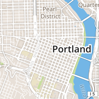
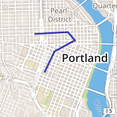
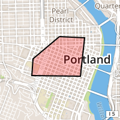

# MapboxStatic

MapboxStatic is a Swift library for Mapbox's [static maps API](https://www.mapbox.com/developers/api/static/), with support for overlays, asynchronous imagery fetching, and first-class Swift data types. 

Static maps are flattened PNG or JPG images, ideal for use in table views, image views, and anyplace else you'd like a quick, custom map without the overhead of an interactive view. 

## Installation 

Drag the `MapboxStatic.swift` file into your project. 

## Usage

You will need a [map ID](https://www.mapbox.com/foundations/glossary/#mapid) from a [custom map style](https://www.mapbox.com/foundations/customizing-the-map) on your Mapbox account. You will also need an [access token](https://www.mapbox.com/developers/api/#access-tokens) in order to use the API. 

### Basics

The main map class is `MapboxStaticMap`. To create a basic map, specify the center, zoom level, pixel size, and retina scale: 

```swift
let map = MapboxStaticMap(
    mapID: <your map ID>,
    center: CLLocationCoordinate2D(latitude: 45.52, longitude: -122.681944),
    zoom: 13,
    size: CGSize(width: 500, height: 300),
    accessToken: <your API token>,
    retina: (UIScreen.mainScreen().scale > 1.0)
)
```

Then, to retrieve an image, you can do it either synchronously (blocking the calling thread): 

```swift
self.imageView.image = map.image
```



Or you can pass a completion handler to update the UI thread after the image is retrieved: 

```swift
map.imageWithCompletionHandler({ (image: UIImage?) in
    self.imageView.image = image
})
```

If you're using your own HTTP library or routines, you can also retrieve a map object's `requestURL` property. 

```swift
let requestURLToFetch = map.requestURL
```

### Overlays

Overlays are where things get interesting! You can add [Maki markers](https://www.mapbox.com/maki/), GeoJSON geometries, and even paths made of bare coordinates. 

You pass overlays as the `overlays: [Overlays]` parameter during map creation. Here are some versions of our map with various overlays added. 

#### Marker

```swift
let markerOverlay = MapboxStaticMap.Marker(
    coordinate: CLLocationCoordinate2D(latitude: 45.52, longitude: -122.681944),
    size: .Medium,
    label: "cafe",
    color: UIColor.brownColor()
)
```


#### GeoJSON

```swift
let GeoJSONOverlay = MapboxStaticMap.GeoJSON(
    GeoJSON: NSString(
        contentsOfFile: NSBundle.mainBundle().pathForResource("sample", ofType: "geojson")!,
        encoding: NSUTF8StringEncoding,
        error: nil
    )!
)
```



#### Path

```swift
let path = MapboxStaticMap.Path(
    pathCoordinates: [
        CLLocationCoordinate2D(
            latitude: 45.52475063103141, longitude: -122.68209457397461
        ),
        CLLocationCoordinate2D(
            latitude: 45.52451009822193, longitude: -122.67488479614258
        ),
        CLLocationCoordinate2D(
            latitude: 45.51681250530043, longitude: -122.67608642578126
        ),
        CLLocationCoordinate2D(
            latitude: 45.51693278828882, longitude: -122.68999099731445
        ),
        CLLocationCoordinate2D(
            latitude: 45.520300607576864, longitude: -122.68964767456055
        ),
        CLLocationCoordinate2D(
            latitude: 45.52475063103141, longitude: -122.68209457397461
        )
    ],
    strokeWidth: 2,
    strokeColor: UIColor.blackColor(),
    fillColor: UIColor.redColor(),
    fillOpacity: 0.25
)
```



### Other options

When creating a map, you can also specify PNG or JPEG image format as well as various [bandwidth-saving image qualities](https://www.mapbox.com/developers/api/static/#format). 

Be sure to [attribute your map](https://www.mapbox.com/developers/api/static/#attribution) properly! 

### More info

For more info about the Mapbox static maps API, check out the [web service documentation](https://www.mapbox.com/developers/api/static/). 
